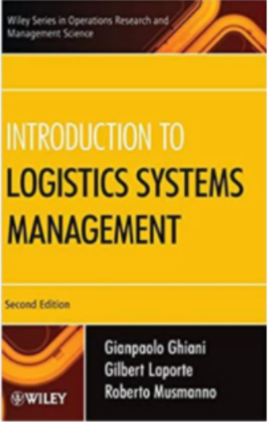
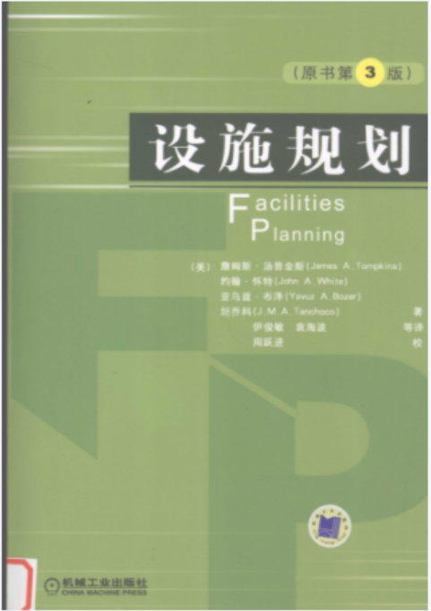
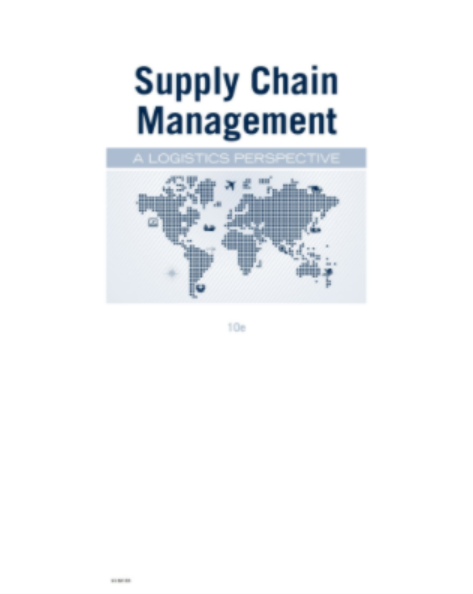

# 物流与供应链管理

## 课程简介

- 先修要求：运筹学
- 课程难度：🌟🌟
- 学习建议：学了这门课后，对于从实际情景中分析问题、巧妙建立模型（好难）、掌握算法思维帮助很大。

**物流**：它是供应链中的一个组成部分。在满足客户需求的整个过程中，它通过计划、实施和控制使产品、服务及相关信息能够从起始点到消费终点有效并高效地流通和存储。

**供应链**：由原材料加工为成品并送到用户手中这一过程涉及地合作企业和部门所组成地网络。

**供应链管理**：是一种集成的管理思想和方法，它执行供应链中从供应商到最终用户的物流的计划和控制等职能。

供应链绩效的物流驱动因素（设施、库存、运输）和跨职能驱动因素（信息、采购、定价）决定了供应链的响应性和效率。该课程分别这六个因素出发，教授这六个决策对供应链的影响。

## 课程资源

- 课程推荐书籍

  | 书名                                               | 作者                                                         | 封面                                                         | 链接                                                         | 评价                 |
  | -------------------------------------------------- | ------------------------------------------------------------ | ------------------------------------------------------------ | ------------------------------------------------------------ | -------------------- |
  | ***Introduction to Logistics Systems Management*** | Gianpaolo Ghiani, Gilbert Laporte, Roberto Musmanno, Wiley.  |  | [Introduction to Logistics Systems Management](https://pan.baidu.com/s/1YvikgFJEd-Nkm3L2bGVC6A?pwd=1234) | 偏建模的书，首选阅读 |
  | ***Facilities Planning***                          | James A. Tompkins, John A. White, Yavuz A. Bozer, J.M.A. Tanchoco |  | [设施规划](https://pan.baidu.com/s/1sLV5GEZND2W373kLQTp1QQ?pwd=1234 ) | 配合设施选址章节阅读 |
  | ***Supply Chain Management***                      | John J. Coyle, C. John Langley  JR. , Robert A. Novack, Brian J. Gibson |  | [supply chain management](https://pan.baidu.com/s/1pMqnhYKSMimYzZuzYkrjrQ?pwd=1234) |                      |

- 课程作业：平时作业 + 一次CVRP程序实现（比优化算法简单）+ 牛鞭效应实验报告
